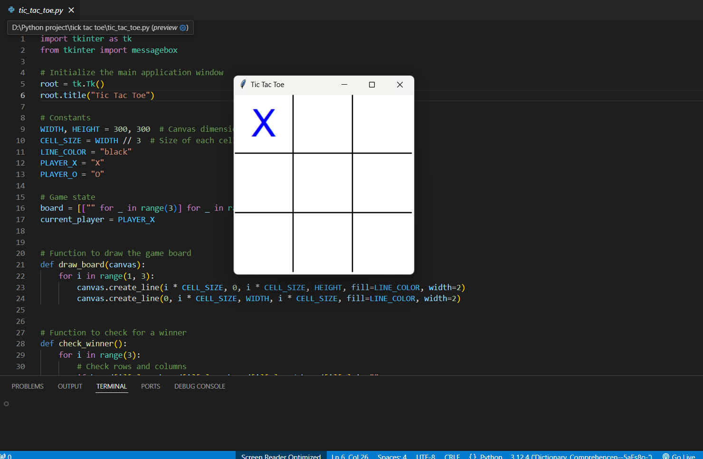
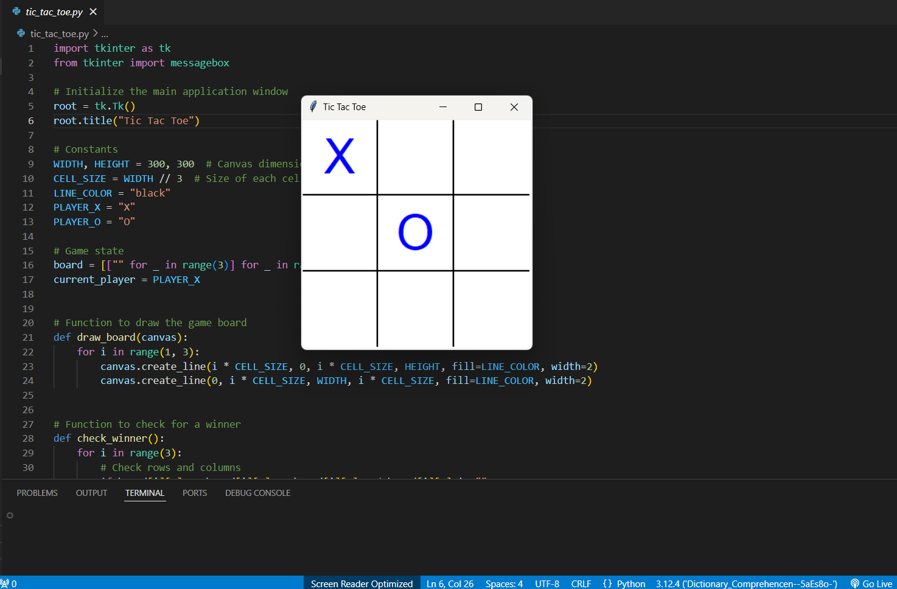
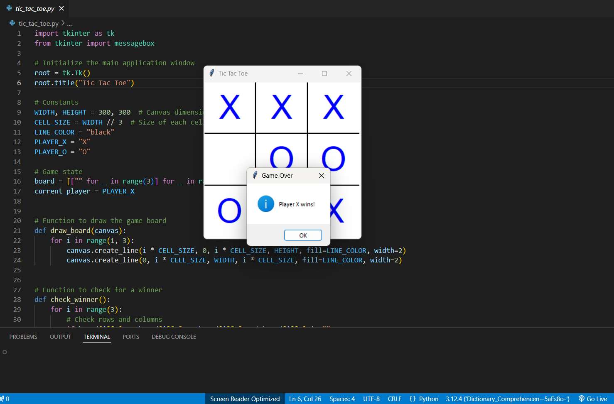

# Tic Tac Toe Game 🎮

A simple, interactive **Tic Tac Toe** game built using Python's `tkinter` module. This game is designed to demonstrate basic GUI programming and logic implementation in Python.

---

## ✨ Features

- **Interactive Game Board**: Click-based player input using `tkinter.Canvas`.
- **Winner/Tie Detection**: Alerts for winning or tying the game.
- **Reset Button**: Automatically resets the board after a game ends.
- **User-Friendly Interface**: Clean and intuitive design.

---

## ⚙️ Requirements

- Python 3.6 or higher
- `tkinter` module (comes pre-installed with Python)

---

## 🚀 Installation

1. Clone the repository:
   ```bash
   git clone https://github.com/rahul886297/tic-tac-toe-game.git
   cd tic-tac-toe-game
2. Run the game:
```bash
python tic_tac_toe.py
```

## 📖 Usage

- Start the Game: Open the application by running the tic_tac_toe.py script.
- Play the Game:
  - Player 1 uses X.
  - Player 2 uses O.
- Click on the desired cell to mark your move.
- Win or Tie: The game alerts the winner or declares a tie.
- Restart Automatically: The game resets the board after each round.

## 📷 Screenshots

### Game Board


### Other Player's Turn


### Winning Screen


**Author:** [Rahul Mandal](https://github.com/rahul886297) 
